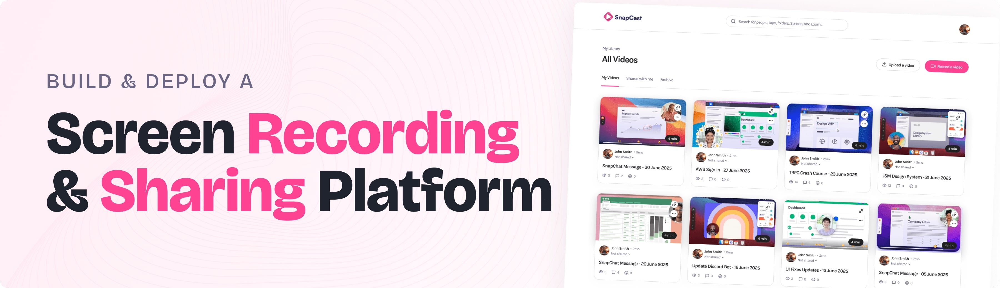

<div align="center">
  <br />
      
  <br />

  <div>
    
    
    
  </div>

  <h3 align="center">Full Stack Screen Recording & Video Sharing Platform</h3>

</div>

## 📋 <a name="table">Table of Contents</a>

1. 🤖 [Introduction](#introduction)
2. ⚙️ [Tech Stack](#tech-stack)
3. 🔋 [Features](#features)
4. 🤸 [Quick Start](#quick-start)
5. 🔗 [Assets](#links)
6. 🚀 [More](#more)


## <a name="features">🔋 Features</a>

👉 **Authentication**: Secure user sign-up and sign-in with Better-Auth & Google.  

👉 **Screen Recording**: Capture your screen directly within the app for seamless video recording.  

👉 **Video Uploading**: Effortlessly upload videos with a simple interface, supporting both public and private settings.  

👉 **AI Transcripts**: Get AI-generated transcripts for uploaded videos, making content more accessible and searchable.  

👉 **Privacy Control**: Toggle video visibility between public and private, ensuring full control over your content.  

👉 **Arcjet Integration**: Easily implement bot protection, rate limiting, email validation, and attack protection with minimal code, enhancing your app's security.

👉 **Metadata**: Access video metadata, including unique video ID and URL, for easy sharing and referencing.  

👉 **Search Functionality**: Find your videos quickly with an intuitive search bar, streamlining navigation.  

👉 **Share Videos**: Share videos via unique links for easy access and distribution.  

👉 **Modern UI/UX**: Clean, responsive design built with Tailwind CSS for a sleek user experience.  

👉 **Database Integration**: Utilize Xata for real-time, scalable database management.  

👉 **Type-Safe Queries**: Benefit from Drizzle ORM’s type-safe queries for secure and efficient database interactions.  

👉 **Scalable Tech Stack**: Built with Next.js for a fast, production-ready web application that scales seamlessly.  

👉 **Code Reusability**: Leverage reusable components and a modular codebase for efficient development.  

👉 **Cross-Device Compatibility**: Fully responsive design that works seamlessly across all devices.  

And many more, including enhanced security and optimized video performance!


## <a name="quick-start">🤸 Quick Start</a>

Follow these steps to set up the project locally on your machine.

**Prerequisites**

Make sure you have the following installed on your machine:

- [Git](https://git-scm.com/)
- [Node.js](https://nodejs.org/en)
- [npm](https://www.npmjs.com/) (Node Package Manager)

**Cloning the Repository**

```bash
git clone https://github.com/adrianhajdin/screen_recording_sharing_app.git
cd screen_recording_sharing_app
```

**Installation**

Install the project dependencies using npm:

```bash
npm install
```

**Set Up Environment Variables**

Create a new file named `.env` in the root of your project and add the following content:

```env
# Next.js
NEXT_PUBLIC_BASE_URL=http://localhost:3000

# [Xata] Configuration used by the CLI and the SDK
# Make sure your framework/tooling loads this file on startup to have it available for the SDK
XATA_API_KEY=
DATABASE_URL_POSTGRES=

# Google
GOOGLE_CLIENT_ID=
GOOGLE_CLIENT_SECRET=

# BetterAuth
BETTER_AUTH_SECRET=
BETTER_AUTH_URL=http://localhost:3000

# Bunny
BUNNY_STORAGE_ACCESS_KEY=
BUNNY_LIBRARY_ID=
BUNNY_STREAM_ACCESS_KEY=

#ArcJet
ARCJET_API_KEY=
XATA_API_KEY=
```


**Running the Project**

```bash
npm run dev
```

Open [http://localhost:3000](http://localhost:3000) in your browser to view the project.

